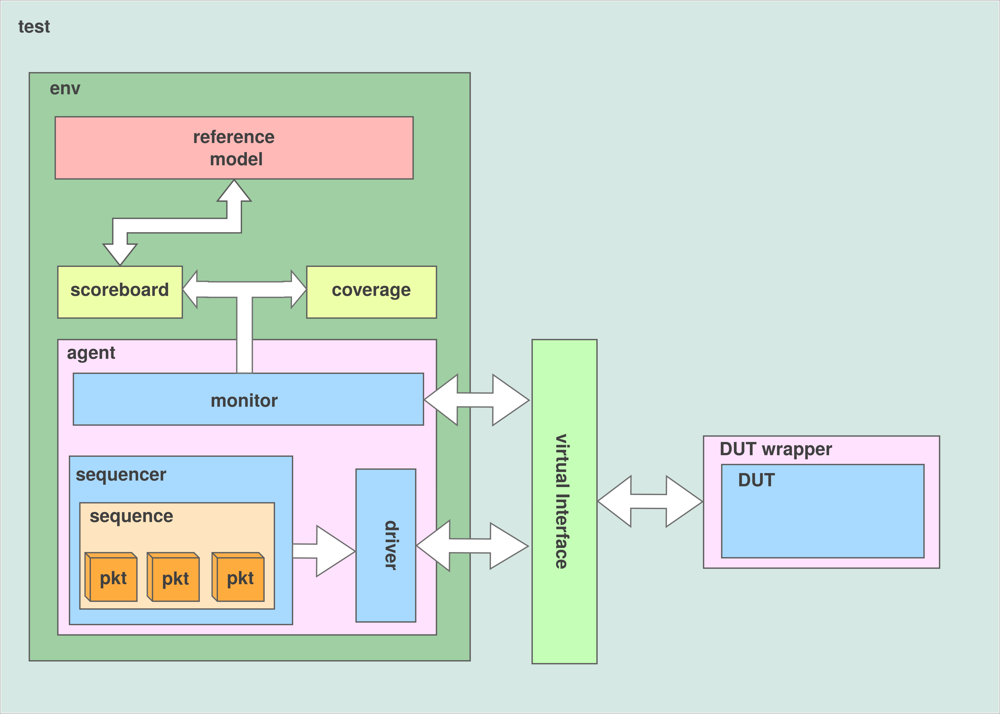

# UVM Verification of the Konshu RV32E Datapath Blocks

<!-- One or two sentences: what this folder is and who it is for. -->

## 1. Overview

Some modules of the Konshu RV32E were verified using a functional verification methodology called UVM, with the purpose of finding functional errors in the core.

UVM (Universal Verification Methodology) consists of building a verification environment with a widely known architecture, used to validate the functionality of an IP.

This type of verification works by sending constrained random packets to the DUT (Device Under Test), monitoring its outputs, and validating them in a scoreboard. The scoreboard uses a reference model written in a high-level language (Python, C, C++), which imitates the functionality of a module described in a hardware description language (VHDL, Verilog, SystemVerilog).

The reason to use UVM instead of a directed testbench is that this technique allows the DUT to be tested against numerous randomized (although constrained) cases, avoiding the manual effort of writing each possible and valid case.

The result of the UVM verification, in this case, is a log with the PASS/FAIL status of each test case, together with the functional coverage reached. With that, we can track which packets caused errors and, by investigating them, analyse what is wrong in the DUT.

## 2. Verification architecture

The architecture developed for this verification consists of the following elements:




| Element | Role |
| --- | --- |
| `pkt` (sequence item) | The transaction. It carries the randomized input fields sent to the DUT and the output fields that the monitor fills in after observing the DUT response. Constraints restrict the randomization to valid cases. |
| `sequence` | Generates the stimulus. It randomizes and sends `pkt` items, one after another, until the coverage collector reports 100%. |
| `sequencer` | Passes the items produced by the sequence to the driver. |
| `driver` | Converts each `pkt` into signal activity on the DUT interface. |
| `monitor` | Watches the interface signals, rebuilds a `pkt` with the inputs and the DUT outputs, and publishes it through an analysis port. |
| `agent` | Groups the sequencer, driver and monitor. |
| `scoreboard` | Receives every monitored `pkt`, calls the reference model and compares its result with the DUT output, reporting PASS or FAIL for each transaction. |
| `coverage` | Subscriber that samples every monitored `pkt` in a covergroup and reports the current coverage to the sequence, so the sequence knows when to stop. |
| `env` | Instantiates the agent, scoreboard and coverage collector and connects the monitor to both checkers. |
| `test` | Top of the UVM hierarchy. It builds the environment and starts the sequence. |
| `s_interface` | SystemVerilog interface with the DUT signals, plus one modport each for the driver, the monitor and the DUT. |
| `*_wrapper.sv` | Wraps the DUT so its ports connect to the interface signals, without changing the RTL. |
| `tb_top.sv` | Top-level module. It generates the clock and reset, instantiates the interface and the wrapped DUT, and starts the UVM test. |

Two configuration database entries connect the pieces: `"vif"` gives the driver and the monitor the virtual interface, and `"cov_status"` lets the coverage collector report the current coverage to the sequence.

## 3. Repository layout

Each block folder follows the same layout:

| Path | Content |
| --- | --- |
| `rtl/` | DUT and its wrapper |
| `tb/` | `s_interface.sv` and `tb_top.sv` |
| `uvm/` | UVM components, package and sequence |
| `reference_model/` | DPI-C golden model (`reference_model.c`) |
| `sim/` | `Makefile`, run script and simulation log |
| `filter/` | Doxygen filter for SystemVerilog |
| `docs/` | Generated Doxygen PDF manual (`refman.pdf`) |

## 4. Reference models (DPI-C)

The architecture also depends on a reference model, which is used to validate the DUT outputs for each test case.

The reference model is written in a high-level language such as C or C++, which partially prevents it from copying the exact coding technique of the DUT.

Throughout the verification, for each test case, the scoreboard sends the input signals that were driven to the DUT to the reference model through a DPI-C function. It then compares the output of the reference model with the actual DUT output, asserting the PASS/FAIL status of each transaction.

Some modules follow a project-specific specification, so the writing of their reference model can be biased by how that specification is interpreted. Others have their specification defined by the RISC-V ISA, like the extend unit.

## 5. Coverage strategy

The verification was executed using a coverage-driven technique. It consists of defining the coverpoints and corner cases of each module, and running the verification (randomizing new packets) until full coverage is reached.

For smaller modules, the coverpoints were defined to exercise every relevant value class (for example every opcode or every register address), but for bigger modules only some general and corner cases were covered.

## 6. Verified blocks

### Blocks verified with UVM

| Block | Folder | What it does | What is checked |
| --- | --- | --- | --- |
| ALU | `alu/` | Execute-stage arithmetic and logic unit. Computes the result and the comparison/branch flag for the 21 `alu_ctrl` opcodes. | `o_alu_result_EX` and `o_equal_EX` for every opcode, including signed and unsigned comparisons and shift amounts. |
| Control unit | `control_unit/` | Decodes the opcode, `funct3` and `funct7[5]` into the control signals of the pipeline (ALU control, immediate format, write-back source, memory write, jump/branch), and generates the PC source select `o_pc_src_EX`. | All control outputs and `o_pc_src_EX`, for the opcodes implemented in the current control unit. |
| Extend unit | `extend_unit/` | Builds the 32-bit sign-extended immediate from the `instr[31:7]` slice, according to the format selected by `imm_src`. | `o_imm_ex_ID` for the I, S, B, J and U formats, and the reserved `imm_src` values. |
| Hazard unit | `hazard_unit/` | Detects the pipeline hazards: forwarding selects for the Execute stage operands, load-use stall and flushes. | Stall, flush and forwarding outputs for random combinations of register addresses and control bits. |
| Register file | `register_file/` | 16 registers of 32 bits, written at the WriteBack stage and read by the `rs1`/`rs2` fields of the Decode stage instruction. Register `x0` is hard-wired to zero. | Both read ports after each write, including `x0` and reading the register that is being written. |

### Modules not verified with UVM

- **Op decoder:** no UVM environment, because a previous directed testbench already found the problems. The changes made after it were: removal of unused `localparam` variables, fix of the `U_TYPE_LUI` opcode, fix of `o_result_src_ID` for `I_TYPE_JALR`, fix of the `jump_ID` signal that was not being set, and use of `localparam` names instead of binary literals.
- **Stage registers, adders, multiplexers, PC target and next PC:** too simple to justify a UVM environment. Only structural changes were made, to keep a standard coding style (see below).
- **Datapath:** it only connects stages and modules, and it follows a project reference model instead of a RISC-V ISA one, so a functional verification would add little.
- **Mem byte:** not used in the core, so it was not verified. Its coding structure was updated to the same standard.

Structural changes applied to these modules and to the verified ones: consistent type declarations (`wire` and `reg` in Verilog files, `logic` only in SystemVerilog files), removal of unused comments, and rewriting for readability.

## 7. Results

| Block | Functional bugs found |
| --- | --- |
| ALU | 3 (fixed) |
| Control unit | None known |
| Extend unit | None |
| Hazard unit | 1 (fixed) |
| Register file | None |

The bugs were found because the scoreboard reported mismatches between the DUT and the reference model.

### Functional bugs found

**ALU** (`alu/rtl/alu.v`): the comparison operations ignored the sign of the operands. The reference model, which implements the signed comparison, exposed the mismatch.

| Problem | Snippet | Expected behavior |
| --- | --- | --- |
| `SLT` compares without considering the sign | `o_alu_result_EX = {{WIDTH-1{1'b0}}, (i_rd1_EX < i_rd2_EX)};` | `SLT` compares `rs1` and `rs2` as **signed** integers |
| `BLT` compares without considering the sign | `o_equal_EX = (i_rd1_EX < i_rd2_EX);` | `BLT` branches if `rs1 < rs2`, as **signed** integers |
| `BGE` compares without considering the sign | `o_equal_EX = (i_rd1_EX >= i_rd2_EX);` | `BGE` branches if `rs1 >= rs2`, as **signed** integers |

**Hazard unit** (`hazard_unit/rtl/hazard_unit.v`): the load-use hazard checked the wrong write-back source.

| Problem | Snippet | Expected behavior |
| --- | --- | --- |
| `load_hazard_detect` was set when the result source was not a load | `assign load_hazard_detect = ((i_result_src_EX == 2'b01) && ((i_rs1Addr_ID == i_rdAddr_EX) \|\| (i_rs2Addr_ID == i_rdAddr_EX)));` | The hazard must be detected when the result source is data memory (`2'b10`) |

### Other findings

- **Extend unit:** no functional problem, all transactions passed. The unused `OFFSET` parameter was removed from the core RTL to simplify the code (the snapshot in `extend_unit/rtl` still has it).
- **Register file:** the UVM verification returned no errors. Its reference model assumes that register `i` is reset to the value `i`, as the RTL does.
- **Control unit:** the reference model covers only the opcodes implemented in the current control unit, and it can be expanded later.

## 8. How to run

### Requirements

To run the simulations, one of the following:

- **Verilator** (5.x; developed with 5.051) and a UVM library adapted for it, with the `UVM_HOME` environment variable pointing to its `src` folder. The runs in this repository used UVM 1800.2-2017-1.0 (`UVM_HOME=<path>/1800.2-2017-1.0/src`). The Makefiles build with `+define+UVM_NO_DPI`.
- **Cadence Xcelium** (`xrun`), which already ships with UVM.

To build the documentation (optional):

- Doxygen (1.16.1 was used), Graphviz (`dot`) for the class graphs, and a LaTeX distribution with `pdflatex` and `makeindex`.
- Perl, to run the SystemVerilog Doxygen filter in `filter/`.

### Simulation

Enter the `sim/` folder of the block and run a target:

```bash
cd alu/sim            # or control_unit, extend_unit, hazard_unit, register_file
make verilator_run    # compile and run with Verilator, writing verification.log
```

Available targets:

| Target | What it does |
| --- | --- |
| `verilator_run` | Compiles and runs with Verilator, saving the output in `verification.log`. |
| `verilator_run_waves` | Same, with an FST waveform dump, and opens it in GTKWave. |
| `xcelium_run` | Compiles and runs with Xcelium, with coverage enabled. |
| `xcelium_run_log` | Same as `xcelium_run`, also saving the output in `verification.log`. |
| `xcelium_gui` | Runs with Xcelium and opens SimVision. |

Reading the results:

- Each transaction prints a `PASS:` or `FAIL:` line from the scoreboard. A `FAIL:` line shows the driven inputs, the expected outputs and the outputs received from the DUT.
- The end of the log has the UVM report summary. A clean run has `UVM_ERROR : 0` and `UVM_FATAL : 0`, and the line `TEST PASS: All transactions were correct.`
- `Total packets sent` shows how many transactions were needed to reach 100% coverage.

### Documentation

Each block has its own Doxygen manual. Inside the block folder:

```bash
cd alu                # or control_unit, extend_unit, hazard_unit, register_file
doxygen Doxyfile      # generates the LaTeX files in docs/
make -C docs          # compiles them into docs/refman.pdf
```

Only `docs/refman.pdf` is tracked in Git, the other generated files are ignored.

## 9. Limitations and future work

- The control unit reference model does not cover the FENCE and SYSTEM (ECALL/EBREAK) opcodes, and the unimplemented opcodes were not verified.
- Points of the ALU that depend on a project decision, and were not verified: whether to use an actual adder instead of the `+` operator, how to invert the second operand for subtraction, the value of `o_equal_EX` in the non-branch operations (0 or don't care), and the default output of the ALU (`z`, `x` or `0`).
- The register file reset values (register `i` reset to `i`) are a project choice, not a RISC-V requirement.
- The code style is still checked by hand. An automatic formatting tool should be adopted.

The core as a whole module is not yet entirelly verified. Some aproaches are still beign studied so that becomes possible.
